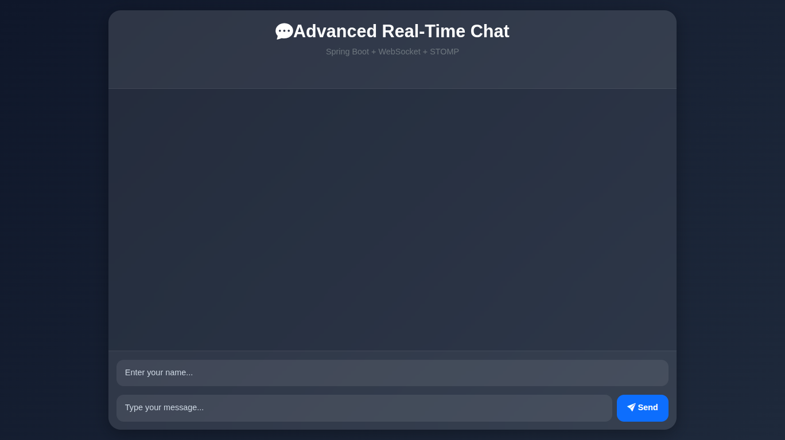
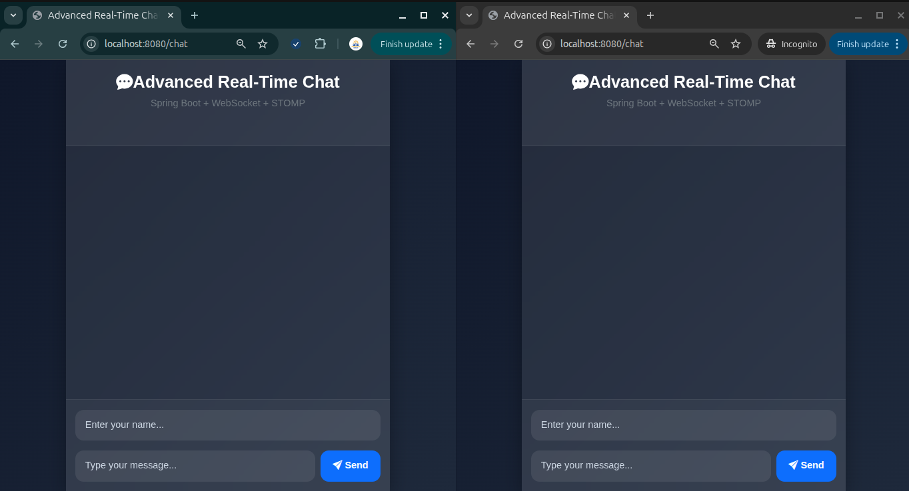
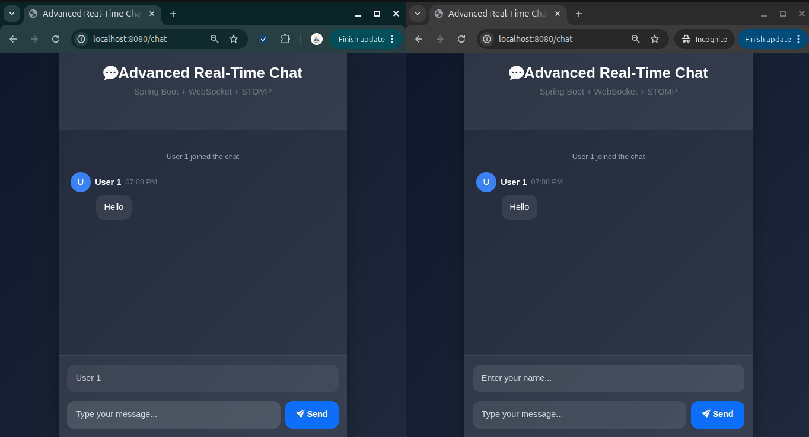
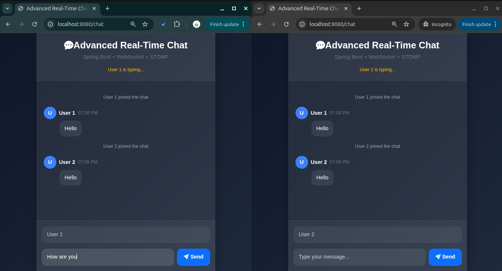
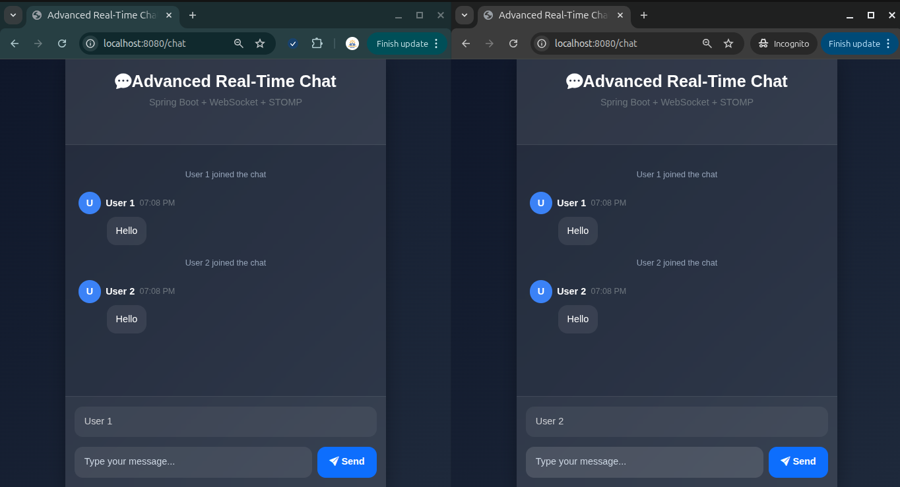
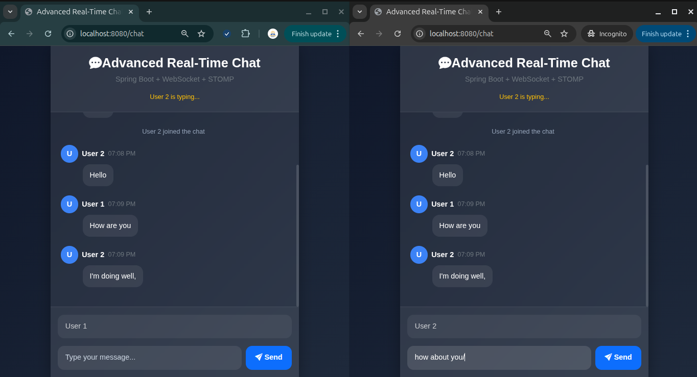
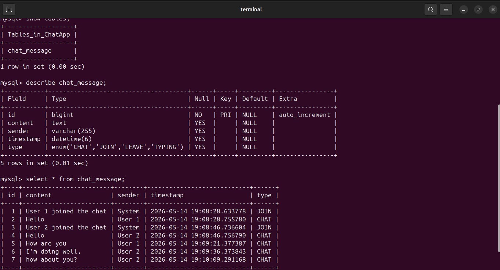

# Real-Time Chat Application

A professional real-time chat application built using:

- Spring Boot
- WebSocket
- STOMP Protocol
- SockJS
- Thymeleaf
- MySQL
- Bootstrap 5

This application supports:
- Real-time messaging
- Multi-user communication
- Message persistence
- Typing indicators
- Join notifications
- Modern responsive UI
- WebSocket communication

---

# Features

## Real-Time Messaging
Messages are instantly broadcasted to all connected users using WebSocket + STOMP.

## Persistent Chat Storage
All messages are stored in MySQL database using Spring Data JPA.

## Typing Indicator
Users can see when someone is typing.

## Join Notifications
System messages appear whenever a new user joins the chat.

## Username Locking
Username becomes readonly after the first message.

## Modern UI
Professional glassmorphism-style responsive interface.

## Auto Scroll
Chat automatically scrolls to the latest message.

## Reconnection Support
Automatically reconnects when connection drops.

---

# Technologies Used

| Technology | Purpose |
|---|---|
| Spring Boot | Backend Framework |
| Spring WebSocket | Real-Time Communication |
| STOMP | Messaging Protocol |
| SockJS | WebSocket Fallback |
| Thymeleaf | Server-Side Rendering |
| MySQL | Database |
| Spring Data JPA | ORM |
| Bootstrap 5 | UI Styling |
| JavaScript | Frontend Logic |

---

# Project Structure

```text
src
└── main
    ├── java
    │   └── com.app.chat
    │       ├── config
    │       │   └── WebSocketConfig.java
    │       ├── controller
    │       │   └── ChatController.java
    │       ├── model
    │       │   └── ChatMessage.java
    │       │   └── MessageType.java
    │       ├── repository
    │       │   └── ChatMessageRepository.java
    │       ├── service
    │       │   └── ChatService.java
    │       └── ChatApplication.java
    │
    └── resources
        ├── static
        │   └── css
        │       └── style.css
        │
        ├── templates
        │   └── chat.html
        │
        └── application.properties
```

---

# Database Setup

## Create Database

```sql
CREATE DATABASE chatapp;
```

---

# Application Configuration

## application.properties

```properties
spring.application.name=chat

spring.datasource.url=jdbc:mysql://localhost:3306/chatapp

spring.jpa.hibernate.ddl-auto=update
spring.jpa.properties.hibernate.dialect=org.hibernate.dialect.MySQLDialect

spring.mvc.hiddenmethod.filter.enabled=true

spring.profiles.active=dev
```

---
## application-dev.properties

```properties
spring.datasource.username=YOUR_USERNAME
spring.datasource.password=YOUR_PASSWORD
```

This file is ignored using `.gitignore` to protect database credentials.

---

# Maven Dependency

Make sure MySQL dependency exists in `pom.xml`

```xml
<dependency>
    <groupId>com.mysql</groupId>
    <artifactId>mysql-connector-j</artifactId>
    <scope>runtime</scope>
</dependency>
```

---

# How to Run

## Clone Repository

```bash
git clone https://github.com/your-username/your-repository-name.git
```

---

## Navigate Into Project

```bash
cd your-repository-name
```

---

## Run Application

```bash
mvn spring-boot:run
```

OR run directly from IntelliJ IDEA.

---

# Open Application

```text
http://localhost:8080/chat
```

---

# WebSocket Architecture

## Client Sends Message

```text
/app/sendMessage
```

---

## Server Broadcasts Message

```text
/topic/messages
```

---

# Application Flow

```text
User Sends Message
        ↓
WebSocket Connection
        ↓
Spring Boot Controller
        ↓
Database Storage
        ↓
Broadcast To Subscribers
        ↓
All Users Receive Message
```

---

# Screenshots

## Homepage



---

## Multiple Users Chatting



---

## User 1 Joined



---

## User 1 Typing



---

## User 2 Joined



---

## User 2 Typing



---

## Database Storage



# Future Improvements

- Private Messaging
- Chat Rooms
- JWT Authentication
- Spring Security
- Redis Pub/Sub
- Docker Deployment
- File Uploads
- Voice Messages
- Video Calls
- Online Presence System
- Read Receipts

---

# Concepts Learned

- Real-Time Communication
- WebSocket Architecture
- STOMP Messaging
- Event-Driven Systems
- Publish/Subscribe Model
- Persistent Connections
- Spring Boot WebSocket
- JPA & Hibernate
- Frontend + Backend Integration

---

# Author

AMARAVADI SANJAY

---

# License

This project is for learning and educational purposes.